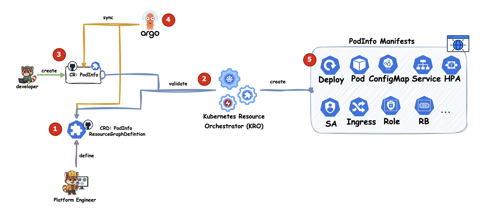

# score-kro-demo

[](https://codespaces.new/mathieu-benoit/score-kro-demo)

## TODOs

First:
- [x] DevContainer with Docker, Kind, Score pre-installed
- [x] Kind cluster setup in [`scripts/setup-kind-cluster.sh`](scripts/setup-kind-cluster.sh)
- [x] Install Kro in [`scripts/setup-kind-cluster.sh`](scripts/setup-kind-cluster.sh)
- [x] Define the Workload `ResourceGraphDefinition`
- [x] Argo setup
- [ ] TODO-`score-k8s` setup --> Mathieu
- [ ] In-cluster Redis
- [ ] "Fake" KCC Memorystore (Redis)

--> Objective: be able to deploy `podinfo` via Score and Kro, with env vars or args.

Rough script for the "first demo":
```bash

./scripts/setup-kind-cluster.sh


### Score ###
score-k8s init ...

score-k8s generate podinfo/score.yaml --image ghcr.io/stefanprodan/podinfo:latest --namespace podinfo-app-score --generate-namespace

# With GitOps
cp manifests.yaml apps/score-podinfo.yaml
# Without GitOps
kubectl apply -f manifests.yaml

### Kro ###
# Kro part with GitOps
cp podinfo/kro-cr-podinfo.yaml apps/kro-cr-podinfo.yaml

# Kro part without GitOps
kubectl apply -f kro/kro-rgd-podinfo.yaml
kubectl apply -f podinfo/kro-cr-podinfo.yaml
```


## Demo 0:

IDEA: showing limits of Kro, and how Score can help. But also showing if it the right way to go.




```bash
cp podinfo/kro-cr-podinfo.yaml apps/kro-cr-podinfo.yaml
```

But what about Day-2? Provide a v2 of RGD?

Change from:

```yaml
    - id: appNamespace
      template:
        apiVersion: v1
        kind: Namespace
        metadata:
          name: ${schema.spec.namespace}
          # labels:
          #   pod-security.kubernetes.io/enforce: "restricted"
          #   pod-security.kubernetes.io/audit:    "baseline"
          #   pod-security.kubernetes.io/warn:     "baseline"
```
To:

```yaml

    - id: appNamespace
      template:
        apiVersion: v1
        kind: Namespace
        metadata:
          name: ${schema.spec.namespace}
          labels:
            pod-security.kubernetes.io/enforce: "restricted"
            pod-security.kubernetes.io/audit:    "baseline"
            pod-security.kubernetes.io/warn:     "baseline"
```

This is an easy change, but what about more complex changes?
Not even created by the platform engineers, but by developers like rename the resources in the podinfo app?
Will create a second app and dont clean up the first one.

Limits:     - CEL, ARGS/Lists [], Depends on Operator - No Dry Run.... -> create role and rolebinding based on an input list of subjects (list, objects)

Decision:

KRO limitations → Should we address them with Score, or use other tools?

New limitations: Out of 10 engineers, maybe only 2 are aware of the added complexity.
But with Score you can define behavior directly, without relying on an operator.

See next Demo 1.

## Demo 1:

- Diagram
- Commands
- Output/Learnings

## Else

- KRO limitations:
    - CEL
    - ARGS/Lists []
    - Iterate over Objects, etc.
    - DAY 2 Operation, Error Handling
    - Depends on Operator - No Dry Run

    - Use Same CR, but rename name, namespace -> Create a new application and don`t clean up the old one
