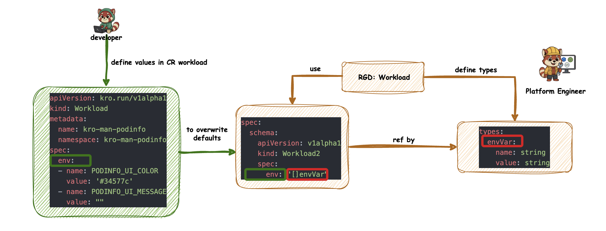
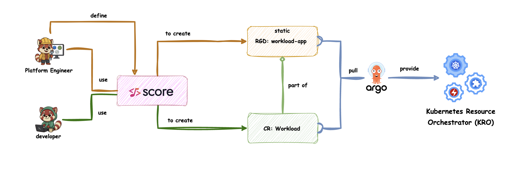
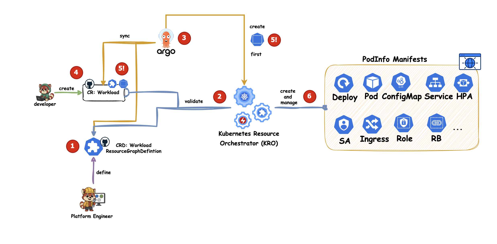
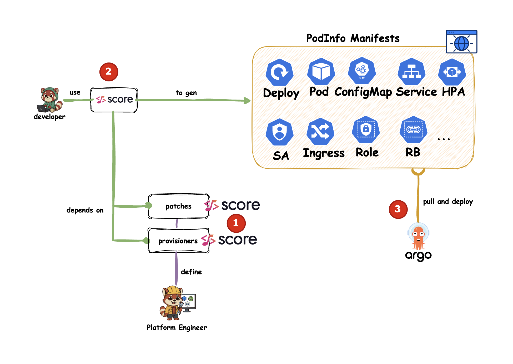

# score-kro-demo

[](https://codespaces.new/mathieu-benoit/score-kro-demo)

## Setup

Prepare a local Kubernetes cluster:

```bash
./scripts/setup-kind-cluster.sh
```

Apply a sample KRO ResourceGraphDefinition (RGD) and Custom Resource manually:

```bash
kubectl apply -f kro/workload.yaml
kubectl apply -f apps/kro-cr-podinfo.yaml
```

## Using Score

```bash
score-k8s init \
    --no-sample \
    --no-default-provisioners \
    --patch-templates https://raw.githubusercontent.com/score-spec/community-patchers/refs/heads/main/score-k8s/namespace-pss-restricted.tpl \
    --patch-templates ./score-k8s/kro-workload-patch-template.tpl \
    --provisioners ./score-k8s/kro-provisioners.yaml

score-k8s generate podinfo/score.yaml \
    --image ghcr.io/stefanprodan/podinfo:latest \
    --namespace podinfo \
    --generate-namespace \
    --override-property containers.podinfo.variables.PODINFO_UI_MESSAGE="Hello, from ArgoCD, Kro and Score!" \
    --output apps/gen-by-score-podinfo.yaml
```

## Deployment

```bash
# Option 1 – Manual deployment (without GitOps)
kubectl apply -f apps/gen-by-score-podinfo.yaml

# Option 2 – GitOps workflow
git push
```

---

# Demos

In the following demos, we gradually increase complexity to explore:

* Why abstraction tools like KRO can be challenging for many teams,
* What their limits are, and
* How to overcome these limits—or even remove unnecessary layers—by choosing the right tools for your platform and team.

---

## Demo 1 – Limits of KRO

If you want to learn the basics of KRO, check out:

* [Kubernetes Resource Orchestrator (KRO) Docs](https://kro.run/docs/overview)
* [Introducing Kubernetes Resource Orchestrator (KRO) – Video by Abdellfetah Sghiouar](https://www.youtube.com/watch?v=0kCeqRMO7aU)

We explored KRO because we liked the concept, but we quickly found that its basic approach didn’t fit our day-to-day needs as engineers. As discussed in the Reddit thread, many teams with advanced requirements hit similar limitations.

Our goal:
Provide developers a simple way to deploy applications using a predefined `CustomResource` designed by platform engineers, following best practices.

Let’s see how far we can go with KRO.


### How it works

1. The **Platform Team** defines a ResourceGraphDefinition (RGD) `workload-app` including best practices like resource limits, probes, security context, and pod disruption budgets.
2. **KRO** validates the `workload-app` definition and allows creation of `Workload` CustomResources (CR) from the RGD.
3. The **Developer** creates a new `Workload` CR defining app-specific values such as name, image, replicas, ports, and environment variables.
4. **Argo CD** watches a Git repository folder and deploys the new `Workload` CR to the cluster.
5. The **KRO Operator** observes these `Workload` CRs and generates all required Kubernetes resources defined in the RGD.

We simulate this by copying an example CR from the `podinfo` demo:

```bash
cp podinfo/gen-man-by-dev-podinfo.yaml apps/gen-man-by-dev-podinfo.yaml
```

You can easily predefine standard configurations (resource limits, probes, securityContext, etc.) for simple apps. But as soon as developers need to adjust basic values like environment variables or ports, we hit limitations — and documentation was lacking.

---

### Generic Type Limitations

We wanted a simple way to let developers define environment variables — just a list of key/value pairs. However, KRO didn’t support this directly.

We ended up defining custom types:

```yaml
types:
  port:
    name: string
    protocol: string
    containerPort: integer | required
  envVar:
    name: string
    value: string
```

Then used them like this:

```yaml
spec:
  schema:
    ...
    env: "[]envVar"
```

Example developer CR:

```yaml
apiVersion: kro.run/v1alpha1
kind: Workload
metadata:
  name: podinfo-app
  namespace: test
spec:
  env:
    - name: PODINFO_UI_COLOR
      value: "#34577c"
    - name: PODINFO_UI_MESSAGE
      value: ""
```



You are limited to simple types (`string`, `integer`, `boolean`, `float`). For anything more complex (arrays, objects, maps), you should define custom types manually.

---

## Demo 2 – Overcoming Type Limits with Score

This approach works but feels hacky.
To improve it, we introduced [Score](https://score.dev/) — adding another layer on top of KRO to generate `Workload` CRs dynamically using Go templating.


This way, Score can creates both the RGD `workload-app` and the CR `Workload`, simulating developer behavior while removing many KRO limitations.

- score-k8s/kro-workload-patch-template.tpl ✅

```bash
score-k8s init \
    --no-sample \
    --no-default-provisioners \
    --patch-templates https://raw.githubusercontent.com/score-spec/community-patchers/refs/heads/main/score-k8s/namespace-pss-restricted.tpl \
    --patch-templates ./score-k8s/kro-workload-patch-template.tpl

score-k8s generate podinfo/score.yaml \
    --image ghcr.io/stefanprodan/podinfo:latest \
    --namespace podinfo \
    --generate-namespace \
    --output apps/gen-by-score-podinfo.yaml
```

- kro/workload.yaml ❌
CODE

You are maybe asking why not just to try to define more complex types directly in KRO?

Example: creating more complex types like `rbacRule`:

```yaml
types:
  rbacRule:
    apiGroups: "[]string"
    resources: "[]string"
    verbs: "[]string"

rules: "[]rbacRule"
```

Or nested maps:

```yaml
values:
  clusterRole:
    labels: 'map[string]string | default={"eks.amazonaws.com/component": "coredns", "k8s-app": "kube-dns"}'
```

One limitation of CEL is that it is intentionally not Turing-complete — it does not support loops such as for or while, or recursive functions, and only allows simple expressions using filters or functions like all() and exists() over arrays.

Adding Score to KRO allows you:



So, while KRO looks static, Score adds dynamic flexibility through templating. The created RDG is like you execute `helm template` and get the final manifest.

CODE

Of course, you could use Score directly — and we’ll get to that later.
But first, let’s explore more KRO limitations.

---

## Demo 3 – Namespace Limitations



Another issue: creating `Workload` CRs in the same namespace as the app.
If the namespace doesn’t exist yet, you can’t apply the CR (it’s namespace-scoped).
We had to add a workaround — deploying a `Namespace` manifest with Argo CD before the `Workload` CR.

Example:

```yaml
apiVersion: v1
kind: Namespace
metadata:
  name: kro-man-podinfo
  labels:
    app.kubernetes.io/managed-by: argocd
    pod-security.kubernetes.io/enforce: restricted
```

However, this feels wrong — developers shouldn’t deal with PodSecurityStandards (PSS) or namespaces.
Those should be handled by the platform or tool itself, not as an add step.

We explored various workarounds (default vs. restricted namespaces, flags, conditional logic), but it became messy and unmaintainable.
This led us to reconsider using KRO as the main deployment mechanism.

---

## Demo 4 – Day-2 Operations Limitations

Even if you solve Day-1 issues, Day-2 operations remain challenging.
As a platform team, you want to offer **self-service for developers** while also enforcing **golden paths and operational safety**.

Let’s say the platform team updates the `Workload` definition to version `v2` — adding or removing fields like:

```yaml
- id: serviceAccount2
  template:
    apiVersion: v1
    kind: ServiceAccount
    metadata:
      name: ${schema.metadata.name}-2
```

Developers get no notification or migration path.
Removed fields aren’t cleaned up, and redeployments can fail due to strict decoding errors.

You can version the RGD, but without an upgrade process, migration is painful — a common Day-2 challenge.

Using Score can help here, thanks to templating, versioning, and validation, but that also means skipping KRO entirely.

---

## Demo 5 – Going All-In with Score

We’re not against KRO — it’s a great idea — but for production-grade use cases, it feels too early. But it also still a young project.
We wanted to understand why so many teams struggle with abstraction tools like KRO.
Now we do — by feeling the pain ourselves.

CODE

With Score, you can directly generate all required Kubernetes resources for your application, skipping the extra layer with KRO.




## BUT...

If KRO were just a tool for composing Kubernetes resources for simple applications, it would already be useful — but it can do much more. KRO allows you to compose any kind of resource within Kubernetes, including cloud resources such as AWS S3 Buckets or RDS Instances by using the AWS Controllers for Kubernetes (ACK) or GCP Config Connector (KCC) or Azure Service Operator (ASO).

KRO still has its limitations, but when combined with tools like Score, you can overcome many of them and get the best of both worlds. Of course, this adds another layer of complexity, so you need to decide what kind of self-service experience you want to provide to your developers.

The key takeaway is that you need to understand your specific use case — abstraction can be both helpful and harmful, depending on how and where you apply it.


---

# Improvement Ideas for KRO

* **Namespace creation:** Add a flag in the CustomResource to auto-create namespaces if they don’t exist.
* **Dry-run CLI:** A `kro --dry-run` command to preview generated resources.
* **More complex examples:** Include documentation for advanced use cases (e.g. generic types).
* **Better Day-2 operations support:**
  * Handling new RGD versions gracefully.
  * Automatic field addition/removal with proper synchronization.
* **Improved developer experience:**
  * Clearer logs and event messages.
  * More accessible error handling (not just in operator logs).

## Demo 6 - `score-compose`

```bash
score-compose init \
    --no-sample \
    --patch-templates https://raw.githubusercontent.com/score-spec/community-patchers/refs/heads/main/score-compose/unprivileged.tpl

score-compose generate podinfo/score.yaml \
    --image ghcr.io/stefanprodan/podinfo:latest \
    --override-property containers.podinfo.variables.PODINFO_UI_MESSAGE="Hello, from Compose and Score!"

docker compose up --build -d
```