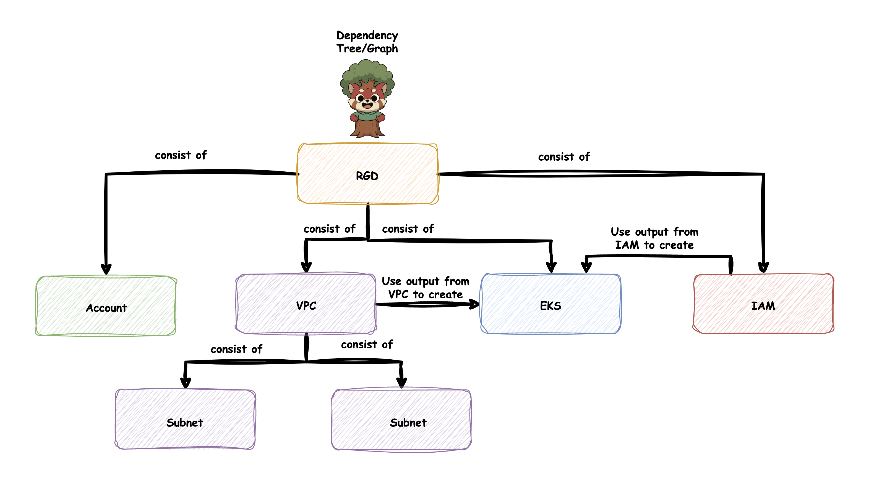
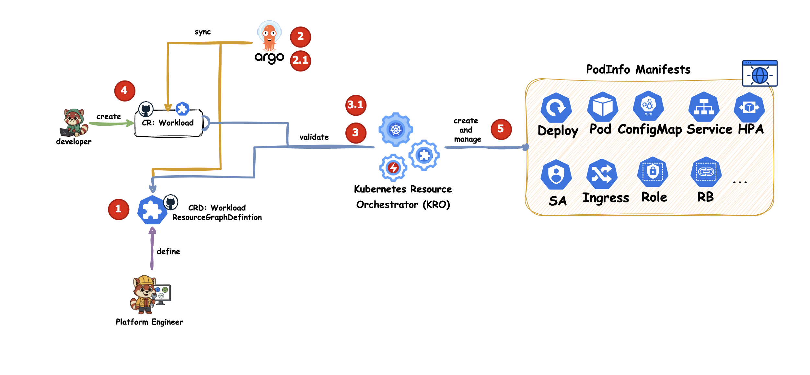
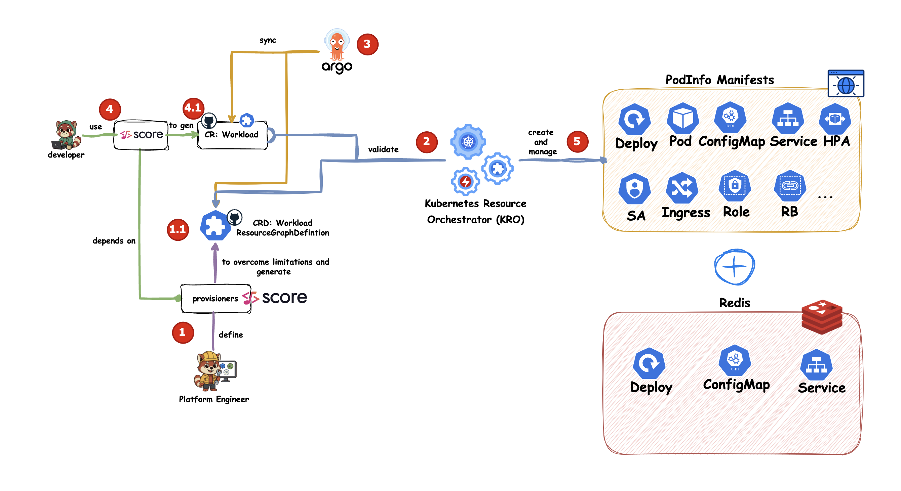
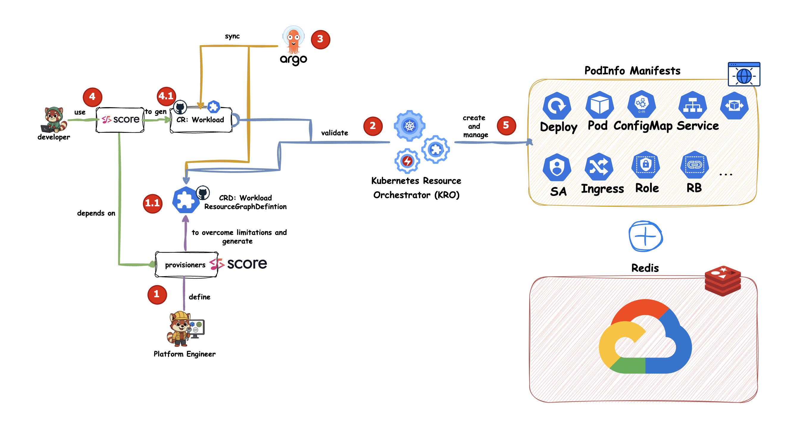
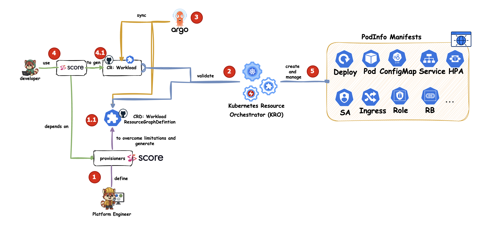
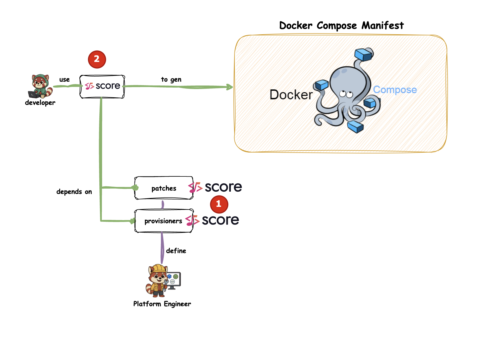

# Demos

In the following demos, we gradually increase complexity to explore:

* Why KRO is a promising tool to simplify Kubernetes resource management and provide a higher level of abstraction for developers
* How you can use KRO to compose both Kubernetes native resources and infrastructure resources
* How you can use Score to add dynamic templating on top of KRO to overcome its limitations
* How you can use Score directly with Docker Compose to skip KRO when it is not needed


TOC:
- [Setup](#setup)
- Kro
  - [Demo #1 - FIXME]()
  - [Demo #1 - FIXME]()
- Score
  - [Demo #3 - FIXME]()
  - [Demo #4 - Score and Docker Compose](#demo-4---score---docker-compose)

## Setup

Prepare a local Kubernetes cluster:

```bash
./scripts/setup-kind-cluster.sh
./scripts/setup-argocd.sh
```

Apply a sample KRO ResourceGraphDefinition (RGD) and Custom Resource manually:

```bash
kubectl apply -f kro/workload.yaml
kubectl apply -f apps/gen-man-by-dev-podinfo.yaml
```

## Demo #1 - KRO - FIXME Compose Kubernetes Native Resources

Why KRO?
KRO is the new kid on the block and a promising tool not only to simplify Kubernetes resource management but also to provide a higher level of abstraction for developers to consume infrastructure resources. We found a few introductions to KRO, but nothing that goes beyond the basics.
So we thought, why not give it a try — explore use cases beyond the basics, show how to build a self-service platform for developers, and share our insights.
Of course, KRO has its limitations and is still marked as not production ready. We’ve documented more of our learnings in [Lessons learned with Kro](./lessons-learned-with-kro.md).

You can do things like this with KRO:



But first, we will use KRO to simplify Kubernetes resource management for developers.




1. The **Platform Team** defines a ResourceGraphDefinition (RGD) `workload` including best practices like resource limits, probes, security context, and pod disruption budgets.
2. **Argo CD** watches a Git repository folder and deploys the new RGD `Workload` to the cluster.
3. **KRO** validates the `workload` definition and allows creation of `Workload` CustomResources (CR) from the RGD. KRO create from the RGD and CRD.
4. The **Developer** creates a new `Workload` CR defining app-specific values such as name, image, replicas, ports, and environment variables.
5. (2.1) **Argo CD** watches a Git repository folder and deploys the new `Workload` CR to the cluster.
6. (3.1.) The **KRO Operator** observes these `Workload` CRs and generates all required Kubernetes resources defined in the RGD.

You can simulate this by copying the example CR from the `podinfo` demo:

```bash
cp podinfo/gen-man-by-dev-podinfo.yaml apps/gen-man-by-dev-podinfo.yaml
```

Take a look at:

- `kro/workload.yaml` - the RGD defined by the platform team
- `podinfo/gen-man-by-dev-podinfo.yaml` - the example CR generated by the developer

## Demo #2 - Kro - Compose Infrastructure Resources - Redis

This is already useful. At this point, we haven’t yet reached KRO’s ability to compose infrastructure resources.
Let’s add Redis so we can use it with the podinfo application as a cache backend.
We can use `inClusterRedis` to deploy a Redis instance inside the Kubernetes cluster alongside the application.
But we can also enable `redisGCP` to use a managed Redis instance in GCP.
Both will be created and managed by KRO. For `redisGCP`, KRO uses the GCP Config Connector (KCC) under the hood to create and manage the Redis instance.



As developers, we just need to add the flag for a running Redis instance inside the cluster:

```yaml
apiVersion: kro.run/v1alpha1
kind: Workload
metadata:
    name: podinfo-kro
    namespace: podinfo-kro
spec:
    inClusterRedis: true #ENABLE INCLUSTER REDIS
    args:
        - --port=9898
        - --cert-path=/data/cert
        - --port-metrics=9797
        - --grpc-port=9999
        - --grpc-service-name=podinfo
        - --cache-server=tcp://podinfo-redis:6379 # ENABLE CACHE
```



If we want to use a managed Redis instance in GCP instead, we just need to change the flag:


```yaml
apiVersion: kro.run/v1alpha1
kind: Workload
metadata:
    name: podinfo-kro
    namespace: podinfo-kro
spec:
    GCPRedis: true #ENABLE GCP REDIS FIXME
    args:
        - --port=9898
        - --cert-path=/data/cert
        - --port-metrics=9797
        - --grpc-port=9999
        - --grpc-service-name=podinfo
        - --cache-server=tcp://FIXME # ENABLE CACHE
```

FIXME

- Limitation: How to point out to the redis cache server before it is created? (FIXME)

But as cool as KRO is, it still has limitations — which we covered in [Lessons learned with Kro](./lessons-learned-with-kro.md).
To overcome these limitations, we need to add another layer of abstraction.

## Demo #3 - Score - FIXME

To improve it, we introduced [Score](https://score.dev/) — adding another layer on top of KRO to generate `Workload` CRs dynamically using Go templating behind the scenes.

So, while KRO looks static, Score adds dynamic flexibility through templating. The created RDG is like you execute `helm template` and get the final manifest.




```bash
score-k8s init \
    --no-sample \
    --no-default-provisioners \
    --patch-templates https://raw.githubusercontent.com/score-spec/community-patchers/refs/heads/main/score-k8s/namespace-pss-restricted.tpl \
    --patch-templates ./score-k8s/kro-workload-patch-template.tpl \
    --provisioners ./score-k8s/kro-provisioners.yaml

score-k8s generate podinfo/score.yaml \
    --image ghcr.io/stefanprodan/podinfo:6.9.2 \
    --namespace podinfo \
    --generate-namespace \
    --override-property containers.podinfo.variables.PODINFO_UI_MESSAGE="Hello, from ArgoCD, Kro and Score!"" \
    --output apps/gen-by-score-podinfo.yaml
```

```bash
# Option 1 – Manual deployment (without GitOps)
kubectl apply -f apps/gen-by-score-podinfo.yaml

# Option 2 – GitOps workflow
git push
```

## Demo #4 - Score - Docker Compose



```bash
score-compose init \
    --no-sample \
    --patch-templates https://raw.githubusercontent.com/score-spec/community-patchers/refs/heads/main/score-compose/unprivileged.tpl

score-compose generate podinfo/score.yaml \
    --image ghcr.io/stefanprodan/podinfo:6.9.2 \
    --override-property containers.podinfo.variables.PODINFO_UI_MESSAGE="Hello, from Compose and Score - Generated by Developer!"

docker compose up --build -d
```


## Conclusion

As you can hopefully see, abstractions are not bad by default.
Tools like KRO can provide great value when used correctly, but you will run into limitations sooner or later.

You can add another layer with tools like Score to overcome these limitations.
However, if you don’t need KRO, you can simply skip it and use Score directly to deliver a great developer experience.
Saying that abstractions are bad by default feels wrong.

Of course, in many cases, we tend to overengineer things and add too many layers of abstraction.
But if you have a valid use case and understand the trade-offs, abstraction can actually help you provide a great developer experience while enforcing best practices.